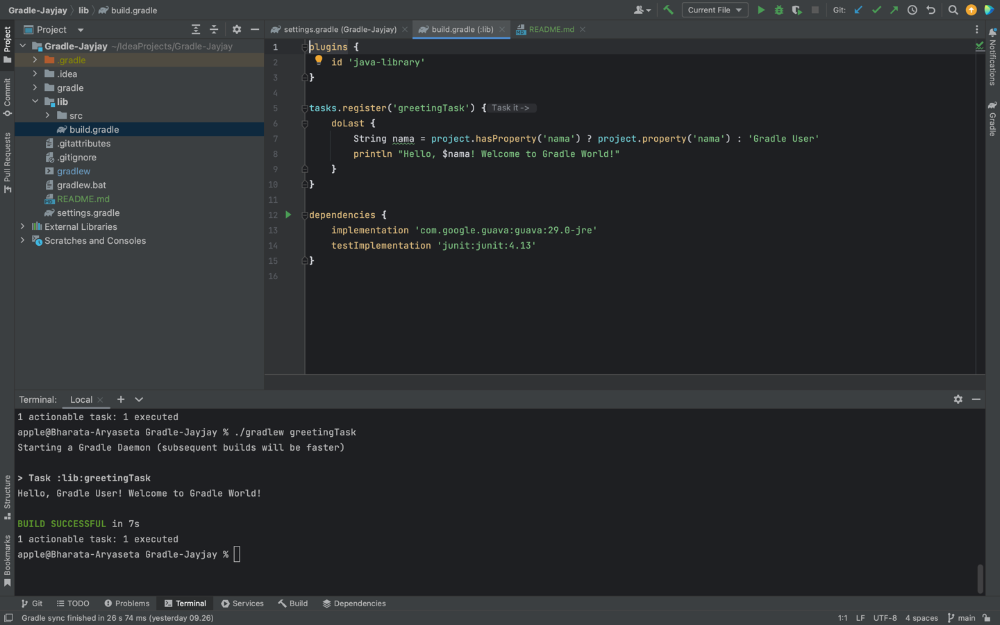

# Gradle dan add libraries

Project ini adalah project tugas Gradle sederhana untuk menerima parameter CLI dan mencetaknya dengan pesan ucapan

## Cara menjalankan project

1. Run dengan nama default 'Gradle User' : Jalankan perintah berikut di terminal "./gradlew greetingTask"
2. Run dengan nama yang diinginkan : "./gradlew greetingTask -Pnama=YourName
   " (Ganti 'YourName' dengan nama yang anda inginkan)

## Screenshot project

1. 

2. 
